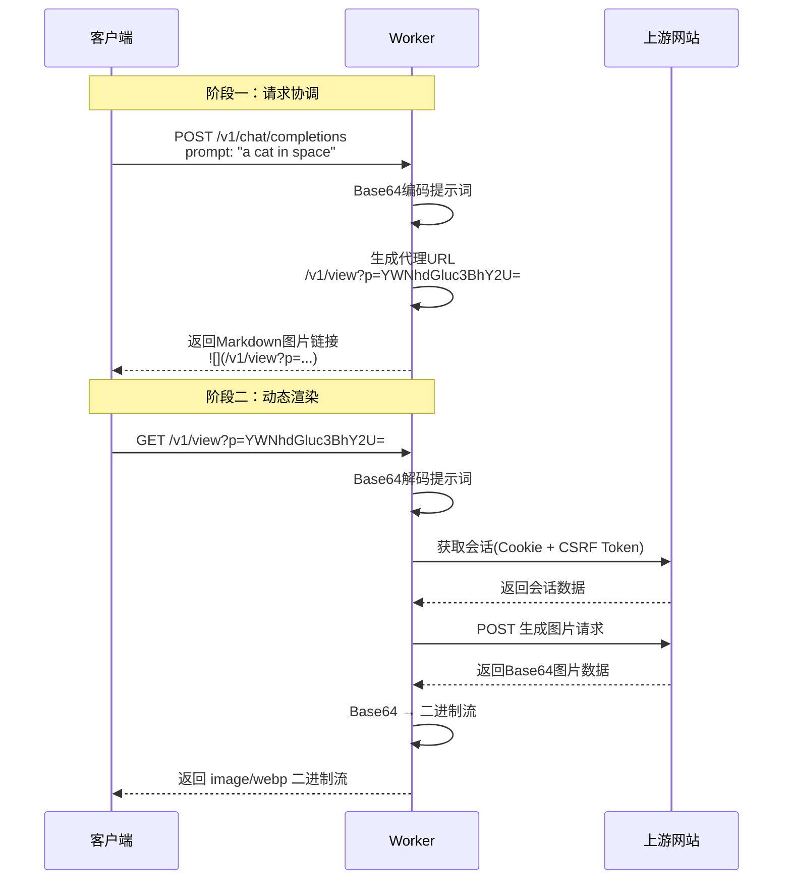
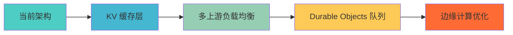

# 📸 photostock-2api (v3.0.0) - 动态代理渲染终极版

<div align="center">


[](https://deploy.workers.cloudflare.com/?url=https://github.com/lza6/photostock-2api-cfwork)

**代号: Proxy Stream - The Ultimate Render (代理流 - 终极渲染)**

> *"我们不是在编写代码，我们是在铸造通往数字世界的桥梁。每一行指令，都是对创造力极限的一次挑战。"*

</div>

## ✨ 核心特性

<div align="center">

| 🚀 终极兼容性 | ⚡️ 零成本部署 | 🎭 完美伪装 | 🧩 双模接口 |
|:---:|:---:|:---:|:---|
| **动态代理渲染技术**<br>告别Base64兼容问题 | **免费Cloudflare账户**<br>全球CDN加速 | **智能会话管理**<br>自动处理安全策略 | **Chat + Image API**<br>全场景覆盖 |

</div>

## 🏗️ 系统架构

```mermaid
graph TB
    subgraph "客户端生态"
        A[Cherry Studio] -->|API调用| B
        C[NextChat] -->|API调用| B
        D[ComfyUI] -->|API调用| B
        E[其他应用] -->|API调用| B
    end

    subgraph "🚀 photostock-2api 代理层"
        B[Cloudflare Worker]
        
        subgraph "API 路由"
            F[/v1/chat/completions] --> G[动态URL生成]
            H[/v1/images/generations] --> I[Base64响应]
            J[/v1/view] --> K[实时图片渲染]
        end
        
        subgraph "核心引擎"
            L[会话管理器] --> M[CSRF Token处理]
            M --> N[Cookie管理]
            O[图片生成器] --> P[Base64解码]
        end
    end

    subgraph "🌐 上游服务"
        Q[photostockeditor.com] --> R[AI绘画引擎]
    end

    G --> J
    K --> O
    O --> Q
    P --> K
    
    style B fill:#ff6b35,stroke:#fff,stroke-width:2px
    style J fill:#4ecdc4,stroke:#fff
    style G fill:#45b7d1,stroke:#fff
```

## 🚀 快速开始

### 一键部署 (推荐)

<div align="center">

[](https://deploy.workers.cloudflare.com/?url=https://github.com/lza6/photostock-2api-cfwork)

</div>

**部署流程:**

1. **点击上方按钮** → 授权 Cloudflare 访问 GitHub
2. **设置环境变量**:
   ```env
   API_MASTER_KEY=your-secret-key-here
   ```
3. **保存并部署** → 等待完成
4. **访问您的 `*.workers.dev` 域名**

### 手动部署

```bash
# 1. 创建 Cloudflare Worker
# 2. 复制 index.js 代码
# 3. 设置环境变量
# 4. 部署生效
```

## 🎯 使用指南

### 客户端配置

| 客户端类型 | API 地址 | 模型名称 |
|:---|:---|:---|
| **Chat 客户端**<br>(Cherry Studio, NextChat) | `https://your-worker.workers.dev/v1/chat/completions` | `photostock-standard` |
| **专业工具**<br>(ComfyUI, SD WebUI) | `https://your-worker.workers.dev/v1/images/generations` | `gpt-4o` |

### 开发者驾驶舱

部署成功后访问您的 Worker 域名，即可看到:

<div align="center">


</div>

## 🧠 核心技术：动态代理渲染

### 🔄 工作流程详解



### 💡 技术优势对比

| 方案 | 兼容性 | 性能 | 用户体验 |
|:---|:---:|:---:|:---|
| **传统 Base64** | ❌ 有限 | ⚡️ 快速 | 👎 图片无法显示 |
| **动态代理渲染** | ✅ 完美 | 🚀 优秀 | 👍 原生图片支持 |

## 🔧 技术架构深度解析

### 📁 代码结构

```
src/
├── 🎯 入口层 (Entry Point)
│   └── fetch 事件处理器
├── 🔧 核心引擎 (Core Engine)
│   ├── 会话管理器 (Session Manager)
│   ├── 图片生成器 (Image Generator)
│   └── 安全中间件 (Security Middleware)
├── 🌐 API 路由 (API Routes)
│   ├── /v1/chat/completions
│   ├── /v1/images/generations
│   └── /v1/view (动态渲染)
├── ⚙️ 配置中心 (Configuration)
│   ├── 环境变量
│   ├── 上游配置
│   └── 请求头伪装
└── 🖥️ 开发者界面 (Developer UI)
    ├── API 测试工具
    ├── 配置展示
    └── 使用文档
```

### 🛠️ 核心技术栈

<div align="center">

| 技术组件 | 用途 | 重要性 |
|:---|:---|:---:|
| **Cloudflare Workers** | 无服务器运行环境 | ⭐⭐⭐⭐⭐ |
| **Fetch API** | HTTP 请求处理 | ⭐⭐⭐⭐⭐ |
| **URLSearchParams** | 表单数据构建 | ⭐⭐⭐⭐ |
| **Base64 编解码** | 数据安全传输 | ⭐⭐⭐⭐ |
| **二进制流处理** | 图片格式转换 | ⭐⭐⭐⭐⭐ |
| **正则表达式** | HTML 数据提取 | ⭐⭐⭐ |
| **TransformStream** | 流式响应支持 | ⭐⭐⭐⭐ |

</div>

### 🎨 开发者驾驶舱 UI 设计

```html
<!-- 现代化暗色主题 -->
<div class="dashboard dark-theme">
    <header class="glass-effect">
        <h1>🚀 photostock-2api 控制台</h1>
    </header>
    
    <section class="api-info-cards">
        <div class="card">
            <h3>🔑 API 密钥</h3>
            <code class="copyable">{{API_KEY}}</code>
        </div>
        <div class="card">
            <h3>🌐 API 地址</h3>
            <code class="copyable">{{API_URL}}</code>
        </div>
    </section>
    
    <section class="test-interface">
        <h3>🎨 实时测试</h3>
        <input type="text" placeholder="输入绘画提示词...">
        <button class="generate-btn">生成图片</button>
        <div class="result-preview"></div>
    </section>
</div>
```

## 🚀 性能优化策略

### ⚡ 当前优化

1. **全局 CDN 加速** - Cloudflare 全球网络
2. **流式响应处理** - 减少内存占用
3. **连接复用** - 保持上游会话

### 🔮 未来优化路线



## 🗺️ 发展蓝图

### ✅ 已实现功能 (v3.0.0)

- [x] **动态代理渲染引擎**
- [x] **双模式 API 接口**
- [x] **自动会话管理**
- [x] **开发者控制台**
- [x] **全客户端兼容**

### 🚧 开发中功能

- [ ] **智能缓存系统** (KV Storage)
- [ ] **错误重试机制**
- [ ] **请求频率限制**
- [ ] **实时监控面板**

### 🔮 未来规划 (v4.0.0)

- [ ] **多上游支持** - 负载均衡
- [ ] **高级参数** - 尺寸、风格控制
- [ ] **批量生成** - 并发处理
- [ ] **插件生态** - 扩展支持

## 🐛 故障排除指南

### 常见问题

| 问题 | 症状 | 解决方案 |
|:---|:---|:---|
| **图片生成失败** | 返回错误信息 | 检查提示词格式，重试 |
| **API 认证失败** | 401 错误 | 验证 API_MASTER_KEY 设置 |
| **上游服务不可用** | 502 错误 | 等待服务恢复或更换上游 |

### 调试模式

```javascript
// 设置调试环境变量
DEBUG_MODE=true
```

## 🤝 贡献指南

我们欢迎所有形式的贡献！请参考以下流程：

1. **Fork 项目**
2. **创建功能分支** (`git checkout -b feature/AmazingFeature`)
3. **提交更改** (`git commit -m 'Add some AmazingFeature'`)
4. **推送到分支** (`git push origin feature/AmazingFeature`)
5. **开启 Pull Request**

## 🙏 致谢

<div align="center">

感谢所有让这个项目成为可能的贡献者和技术：

| 技术 | 贡献 |
|:---|:---|
| **Cloudflare Workers** | 强大的无服务器平台 |
| **photostockeditor.com** | 免费的 AI 绘画服务 |
| **开源社区** | 持续的支持和改进 |

**如果这个项目对您有帮助，请给我们一个 ⭐！**

---

**🚀 创造无界，编码自由！**

</div>

---

*最后更新: 2025年12月1日 07:43:28 | 版本: v3.0.0 | 作者: 首席AI执行官*
